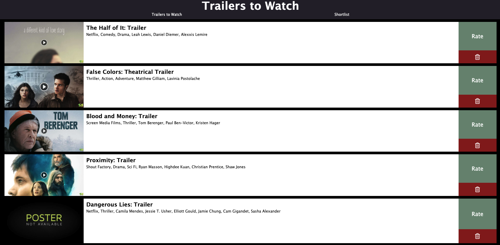
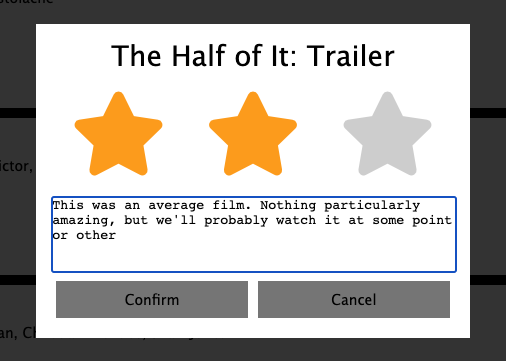
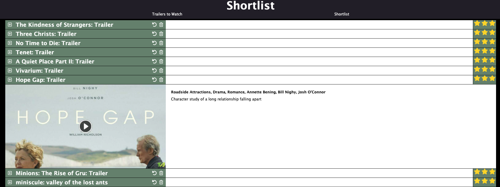

# Trailers

This is the project that made me realise software development was the career for me. It was created before I joined Makers Academy, so the code quality is lacking, and there is no testing. Comparing it to projects completed towards the end of Makers Academy in particular, it shows how much I learned during the 12 week course.

The website was designed to solve a specific problem my wife and I were having. We love to watch films, and one of the main ways we work out what we want to watch is to look at trailers. We subscribe to an RSS feed on a trailer site, and this was being sent to my email client. We would watch trailers, recording any we wanted to watch on a spreadsheet, before trying to remember to add them to our watchlist on Cinema Paradiso. This was a laborious process, prone to error so I set about creating a site that would make it all much easier.

## Example usage

The trailers to watch tab is regularly updated with trailers that are automatically grabbed from the RSS feed. Clicking on one of the trailer images opens the trailer in a new tab so you can watch it and see what you think.

You then either click Rate, which opens up a dialog to give it 1-3 stars and an optional comment, or the dustbin if you don't want to shortlist it.

The shortlist tab lists all films you've shortlisted to watch from the trailers you've seen, along with any comments you made to help you remember what the film is about.

- Clicking the '+' icon expands the display to give more information about the film
- There is a button to return the trailer to the trailers to watch tab if you shortlisted it by mistake, and a dustbin icon if you've watched the film or decided you are no longer interested in watching it.

## Getting started

## Testing

There is no test coverage as this project was completed before I even knew what one was!

## Challenges

The whole project was a massive challenge for me. I'd never used any of the technologies before, and was basically learning as I went. There were a number of specific difficulties I faced though.

### Retrieving data from the RSS feed

I found this incredibly difficult at the time, and couldn't get fetch to work. I ended up utilising a third party rss feed reader to achieve the task.

### Issues with interacting with MongoDB

I had an issue with the scripts that open the DB, add or remove data and then close it again, eg the data migration and backup scripts. Although I could access the database fine, the scripts would hang without closing their connections properly. At the time I accepted this, as the data was still successfully manipulated.
